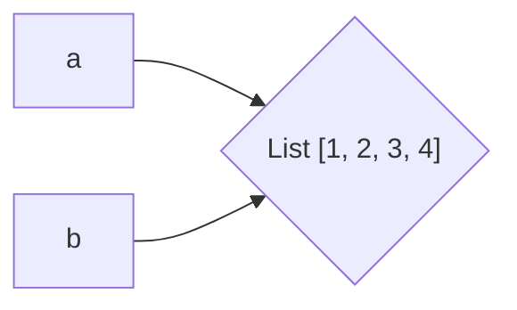

# [[Useful functions and keywords]]

[[2. Python Language Basics, IPython, adn Jupyter Notebooks#isinstance|isinstance]]: Check if an object is an instance of a particular type.
[[2. Python Language Basics, IPython, adn Jupyter Notebooks#getattr|getattr]]: Access attributes and methods of a Python Object.
[[2. Python Language Basics, IPython, adn Jupyter Notebooks#iter|iter]]: Used to know if an object is iterable.
[[2. Python Language Basics, IPython, adn Jupyter Notebooks#as|as keyword]]: Give imports different variable names.
[[2. Python Language Basics, IPython, adn Jupyter Notebooks#is keyword|is keyword]]: Check if two variables refer to the same object.

# 2.1 The Python Interpreter

We cna invoke the interpreter on the command line with the `python` command.

```zsh
$ python
>>> a = 5
>>> print(a)
5
```

You can do the same thing with an IPython project using the `ipython` command and executing a code in a specified file using the `%run` command.
```Python
$ ipython
In [1]: %run hello_world.py
Hello world

In [2]:
```
# 2.2 IPython Basics
These essential concepts and properties can be applied to VSCode with almost the same behavior.
## Tab Completion

Search the namespace: For any variables, such as objects, functions, etc., matching the characters you have typed. The IDE by default hides methods and attributes starting with underscores, such as magic methods and internal "private" methods and atributes.

Complete paths: Pressing the Tab key will complete anything on your computer's filesystem matching what you've typed.

It's useful combined with the `%run` (used tu run another python script inside your workspace).

```Python
%run "<file>.py"
```

## Introspection
Using a question mark (?) before or after a variable will display some general information about the object
```Python
In [1]: print?

Signature: print(*args, sep=' ', end='\n', file=None, flush=False) 
Docstring: Prints the values to a stream, or to sys.stdout by default. 

sep 
	string inserted between values, default a space. 
end 
	string appended after the last value, default a newline. 
file 
	a file-like object (stream); defaults to the current sys.stdout. 
flush 
	whether to forcibly flush the stream. 
Type:         builtin_function_or_method
```
If the object is a function or instance method, the docstring, if define, will also be shown.

? can also be used for searching the namespace. Using the wildcard (\*)  will show all names matching the wildcard expression.

```Python
In [1]: import numpy as np
		np.*load*?
		
np.__loader__ 
np.load 
np.loadtxt
```

# 2.3 Python Language Basics

## Language Semantics

### Everything is an object

An importan characteristic of the Python language is the consistency of its *object model*. Everything you can find in a Python code is a *Python object*. Each object has an associated type (e.g., integer, string or function) and internal data.

### Comments
Any text preceded by the hash mark (pound sign) `#` is ignored by the Python interpreter.
```Python
print("Reached this line") # Simple status report
```

### Variables and argument passing

When assigning a variable you are creating a *reference* to the object shown on the righthand side of the equals sign. For example:

```Python
a = [1,2,3,4]
b = a
b
```
Creates the output:
```Output
[1, 2, 3, 4]
```
Because in this case `a`and `b` now refer to the same object.


> [!info] Nota
> Assignment is also referred to as *binding*, as we are binding a name to an object.

When you pass objects as arguments to a function, new local variables are created referencing the original objects without any copying. For example, the code:

```Python
def append_element(list, element):
    list.append(element)
append_element(a, 5) #There is no other assignment to a
a
```
Creates the output:
```Shell
[1, 2, 3, 4, 5] 
```
### Dynamic references, strong types

A variable can refer to a different type of object simply by doing an assignment. Variables are names for objects within a particular namespace; the type information is stored in the object itself. 

In Python, some implicit casts are not allowed, this is why Python is a *strongly typed* language, wichh means that every object has a specific type (or class).

#### isinstance

You can use it to check that an object is an instance of a particular type. For example, the following code:

```Python
a = 5
isinstance(a,int)
```

Produces the output 
```shell
True
```

### Attributes and methods

Objects in Python typically have both attributes and methods.

Attribute: Other Python objects stored "inside" the object
Method: Functions associated with an object that can have access to the object's internal data.

#### getattr 

Atributes and methods can also be accessed by name via `getattr` function. For example the following code:

```Python
name = "Dana"
getattr(name, "split")
```

Produces the output
```shell
<function str.split(sep=None, maxsplit=-1)>
```
### Duck Typing
Often you may only care whether an object has certain methods or behavior instead of knowing the type of it.

#### iter

The `iter` function can be used to build a function that returns whether if an object is iterable or not. For example, the following code:
```Python
def isiterable(obj):
    try:
        iter(obj)
        return True
    except TypeError: #not iterable
        return False
    
isiterable("a string")
```

Produces the output

```shell
True
```

### Imports
In Python, a *module* is a file tih the `.py` extension containing Python code. If we eanted to access the variables and functions defined in another module, from another file in the same directory we could do:

```Python
import some_module #.py extension is not explicit
result = some_module.f(5)
```

#### as
Using the `as` keyword you can give imports different variable names:

```Python
import some_module as sm #.py extension is not explicit
result = sm.f(5)
```

### Binary operators and comparisons

#### is keyword

It is used to check if two variables refer to the same object. It follows the same logic if you need to check if a variable refers to `None` object. For instance, the following code:

```Python
a = [1,2,3]
b = a
c = list(a)
d = None
print(a is b)
print(a is c)
print(a is d)
print(d is None)
print(a is None)
```
Produces the output:
```shell
True
False
False
True
False
```
Since the `list` function always creates a new Python list (i.e., a copy), `c` refers to a distinct object than `a`. Comparing with `is` is not the same as the `==` operator. In this case, using the same variables as above, we have:
```Python
a == c
```
Produces the output:
```shell
True
```

### Mutable and immutable objects

**Mutable**: the object or values that it contains can be modified.

Examples of mutable objects in Python:
- Lists
- Dictionaries
- NumPy arrays
- Most user defined types (classes)

Examples of immutable objects in Python:
- Strings
- Tuples